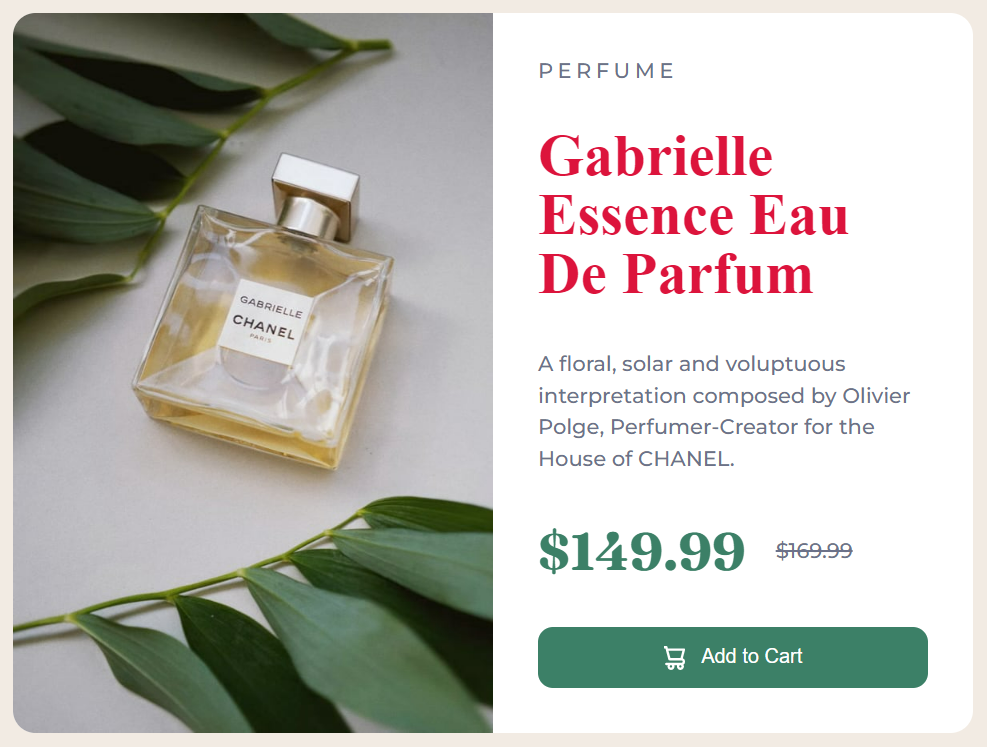

# AssignmentFirst
## Task1
# Original Page
## 
# Achieve the following with DOM manipulation
# Task1 Page
## 
# Here, JavaScript Code
```
let li0 = document.querySelector("ul");
li0.innerHTML = `<a href="./index.html">Home</a></li>
<a href="./about/about.html">About</a></li>
<a href="./contact/contact.html">Projects</a></li>
<a href="./contact/contact.html">Hire Me</a></li>
`;

let li1 = document.querySelectorAll("ul");
li1[1].innerHTML = "";
```

## Task2
# Original Page

## 

# Achieve the following with DOM manipulation

## 

# Here, JavaScript Code
```
let li = document.querySelector("ul");
li.innerHTML = `<a href="./index.html">Home</a></li>
<a href="./about/about.html">About</a></li>
<a href="./contact/contact.html">Projects</a></li>
`;

let btn = document.querySelector(".search-field");
btn.innerHTML = `<input type="text" name = "name"placeholder="Search My Project" />
<button>Search</button>`;

let li1 = document.querySelectorAll("ul");
li1[1].innerHTML = "";
```

## task3

# Original Page

## 

# Achieve the following with DOM manipulation

## 

# Here, JavaScript Code
```
let li = document.querySelector("ul");
li.innerHTML = `<a href="./index.html">Home</a></li>
<a href="./about/about.html">About</a></li>
<a href="./contact/contact.html">Projects</a></li>
`;

let value = document.getElementsByTagName("span");
value[2].innerText = "an Employee";
value[3].innerText = "INeuron Intelligence Pvt Ltd"
```

## task4

# Original Page

## 

# Achieve the following with DOM manipulation

## 

# Here, JavaScript Code
```
let li = document.querySelector("ul");
li.innerHTML = `<a href="./index.html">Home</a></li>
<a href="./about/about.html">About</a></li>
<a href="./contact/contact.html">Projects</a></li>
`;

let img = document.querySelector(".hero-right-section");
img.innerHTML = `

<!-- div for putting the button -->
<div class="hero-right-section-btns">
  <button>Chat With Me</button>
</div>`;
```

## task5

# Original Page

## 

# Achieve the following with DOM manipulation

## 

# Here, JavaScript Code

```
let li = document.querySelector("ul");
li.innerHTML = `<li><a href="./index.html">Home</a></li>
<li><a href="./about/about.html">About</a></li>
<li><a href="./contact/contact.html">Projects</a></li>
`;

let btn = document.querySelector(".hero-right-section-btns");
btn.innerHTML = `<button>Chat With Me</button>
<button>Support Me</button>
`;
let num = document.getElementsByTagName("button");
num[2].innerHTML = "<button>Chat With Me</button>";
console.log(num);
```

# AssignmentSecond
## task1
# Original Page

## 

# Achieve the following with DOM manipulation

## 

# Here, JavaScript Code

```
let ulList = document.querySelector('ul');
console.log(ulList);
let listInside = ulList.getElementsByTagName('li');
console.log(listInside);
listInside[2].textContent = "Projects"
for(let i = 0;i<accordian.length;i++){
  let elementHeading = accordian[i];
  elementHeading.style.backgroundColor = '#dadaf8';
}
for(let i = 2 ; i<accordian.length;i++){
  let nextElement = accordian[i].nextElementSibling
  nextElement.style.display = 'block';
}
```
## task2
# Original Page

## 

# Achieve the following with DOM manipulation

## 

# Here, JavaScript Code
```
let listUl = document.querySelector("ul");
let listLi = listUl.getElementsByTagName("li");
listLi[2].innerHTML = "Projects";

let value = document.querySelector(".accordian-wrapper");
let divAdd = document.createElement("div");
divAdd.classList.add("accordian");
divAdd.innerHTML = `<h3>Skills</h3><p>I posses a very good command over the Full Stack Development technologies like MERN which can be seen in my work over the github.</p>`;
value.append(divAdd);


let accordian = document.querySelectorAll(".accordian h3");
accordian.forEach((element) => {
  element.addEventListener("click", () => {
    let para = element.nextElementSibling;
    if (para.style.display === "block") {
      para.style.display = "none";
    } else {
      para.style.display = "block";
    }
    // para.style.color = "#758283";
  });
  element.style.backgroundColor = "#dadaf8";
});
```

# AssignmentThird

## task1
# Original Page

## 

# Achieve the following with DOM manipulation

## 

# Here, JavaScript Code
```
let input = document.querySelectorAll(".mainLeftDetails");
input[0].innerHTML = `<input class="enterName" type="text" readonly placeholder="FSJS 2.0">
<input class="enterMail" type="email" readonly placeholder="fsjs@ineuron.ai">
<textarea class="enterMessage" readonly placeholder="Hello World"></textarea>
<button type="reset">Reset</button>`;

let input1 = document.querySelectorAll("form");
input1[1].innerHTML = `<input class="enterName" type="text" readonly placeholder="FSJS 2.0">
<input class="enterMail" type="email" readonly placeholder="fsjs@ineuron.ai">
<textarea class="enterMessage" readonly placeholder="Hello World"></textarea>
<button type="reset">Submit</button>`;
```

# 04_DOM Project
# Original Page

## 

#  Achieve the following with DOM manipulation

## 

# Here, JavaScript Code
```
const level4 = document.getElementsByClassName('clash-card__unit-stats clash-card__unit-stats--barbarian');
let colorAsString = '#A77B06';
Array.from(level4).forEach((element) => {
    element.style.backgroundColor = colorAsString;
});


const Level5 = document.getElementsByClassName('clash-card__unit-stats clash-card__unit-stats--giant');
let colorString1 = '#A77B06';
Array.from(Level5).forEach((element) => {
    element.style.backgroundColor = colorString1;
});


const LeveL6 = document.getElementsByClassName('clash-card__unit-stats--wizard');
let colorString5 = '#1B98F5';
Array.from(LeveL6).forEach((element) => {
    element.style.backgroundColor = colorString5;
});

// let val = document.getElementsByClassName("archer");
let val = document.querySelector('.archer');
val.innerHTML = `<div class="clash-card__image clash-card__image--archer">

</div>
<div class="clash-card__level clash-card__level--archer">Level 5</div>
<div>The Archer</div>
<div class="clash-card__unit-description">
The Archer is a female warrior with sharp eyes. She wears a short,
light green dress, a hooded cape, a leather belt and an attached
small pouch.
</div>

<div class="clash-card__unit-stats clash-card__unit-stats--archer clearfix">
<div class="one-third">
    <div class="stat">25<sup>S</sup></div>
    <div class="stat-value">Training</div>
</div>

<div class="one-third">
    <div class="stat">24</div>
    <div class="stat-value">Speed</div>
</div>

<div class="one-third no-border">
    <div class="stat">300</div>
    <div class="stat-value">Cost</div>
</div>
</div>`;

const level5 = document.getElementsByClassName('clash-card__unit-stats clash-card__unit-stats--archer');
let colorString = '#E03B8B';
Array.from(level5).forEach((element) => {
    element.style.backgroundColor = colorString;
});


const value = document.querySelector('.goblin');
value.innerHTML = `<div class="clash-card__image clash-card__image--goblin">

</div>
<div class="clash-card__level clash-card__level--goblin">Level 5</div>
<div>The Goblin</div>
<div class="clash-card__unit-description">
These pesky little creatures only have eyes for one thing: LOOT!
They are faster than a Spring Trap, and their hunger for resources
is limitless.
</div>

<div class="clash-card__unit-stats clash-card__unit-stats--goblin clearfix">
<div class="one-third">
    <div class="stat">30<sup>S</sup></div>
    <div class="stat-value">Training</div>
</div>

<div class="one-third">
    <div class="stat">32</div>
    <div class="stat-value">Speed</div>
</div>

<div class="one-third no-border">
    <div class="stat">100</div>
    <div class="stat-value">Cost</div>
</div>
</div>`;

const LeveL5 = document.getElementsByClassName('clash-card__unit-stats clash-card__unit-stats--goblin');
let colorString2 = '#4DD637';
Array.from(LeveL5).forEach((element) => {
    element.style.backgroundColor = colorString2;
});
```

# 05_DOM Project
# Original Page

## 

#  Achieve the following with DOM manipulation

## 

# Here, JavaScript Code

```
let btn = document.querySelector('.nav-center');
btn.innerHTML = `<div class="nav-header">
<a href="index.html" class="nav-logo">
    
</a>
</div>
<div class="nav-links">
<a href="index.html" class="nav-link"> home </a>
<a href="index.html" class="nav-link"> about </a>
<a href="index.html" class="nav-link"> tags </a>
<a href="index.html" class="nav-link"> recipes </a>
</div>
<div>
<a href="index.html" class="btn"> contact </a>
</div>
<div>
<a href="index.html" class="btn"> Pro Subscription </a>
</div>
`;

let li = document.querySelector('.tags-container');
li.innerHTML = `<h4 class="text-r">recipes</h4>
<div>
    <a href="#"> Veg (1)</a>
    <a href="#"> Non-Veg (2)</a>
    <a href="#"> Breakfasts (3)</a>
    <a href="#"> Starters (4)</a>
    <a href="#"> Desserts (5)</a>
    <a href="#"> Beverages (6)</a>
    <a href="#"> Chinese (7)</a>
</div>
`;

let recip = document.querySelector('.recipe-gallery');
recip.innerHTML = `<div class="card">
<a href="#" class="recipe-text">
    
    <h5 class="recipe-name">Chicken</h5>
    <p class="recipe-disp">Prep : 15min | Cook : 30min</p>
</a>
</div>
<div class="card">
<a href="#" class="recipe-text">
    
    <h5 class="recipe-name">Paneer</h5>
    <p class="recipe-disp">Prep : 15min | Cook : 25min</p>
</a>
</div>
<div class="card">
<a href="#" class="recipe-text">
    
    <h5 class="recipe-name">Tomato Soup</h5>
    <p class="recipe-disp">Prep : 15min | Cook : 5min</p>
</a>
</div>
<div class="card">
<a href="#" class="recipe-text">
    
    <h5 class="recipe-name">Chocolate Cake</h5>
    <p class="recipe-disp">Prep : 20min | Cook : 45min</p>
</a>
</div>
<div class="card">
<a href="#" class="recipe-text">
    
    <h5 class="recipe-name">Hakka Noodles</h5>
    <p class="recipe-disp">Prep : 15min | Cook : 30min</p>
</a>
</div>
<div class="card">
    <h6 class="recipe-name">add 6th card here</h6>
</a>
</div>
`;


const LeveL5 = document.getElementsByClassName('recipe-text');
let colorString2 = '#8D3DAF';
Array.from(LeveL5).forEach((element) => {
    element.style.color = colorString2;
});
```

# 06_Project
# Original Page

## 

#  Achieve the following with DOM manipulation

## 
## 

# Here, JavaScript Code
```
let val = document.querySelector('header');
val.innerHTML = `<header></header>`;
```

# 07_DOM Project
# Original Page

## 

#  Achieve the following with DOM manipulation

## 
## 

# Here, JavaScript Code
```
let value = document.querySelector('.main__languages');
value.innerHTML = `<span class="main__languages-text">
Assignment - 1: Remove the languages that have 2.0 in their
name(Every alternative language)
</span>
<br />
Courses offered:
<a target="_blank" href="https://www.ineuron.ai">JavaScript</a>
<a target="_blank" href="https://www.ineuron.ai">React</a>
<a target="_blank" href="https://www.ineuron.ai">Node</a>
<a target="_blank" href="https://www.ineuron.ai">HTML & CSS</a>
<a target="_blank" href="https://www.ineuron.ai">MERN</a>
`;

let val = document.querySelector('form');
val.innerHTML = `<input
class="main__form-input"
type="text"
placeholder="iNeuron"
disabled
/>
<button class="main__form-btn" type="submit" disabled>
Submit
</button>
`;
```

# 09_DOM Project
# Original Page

## 

#  Achieve the following with DOM manipulation

## 


# Here, JavaScript Code
```
let val = document.querySelector("h1");
val.style.color = 'red';

let cart = document.querySelector(".add-to-cart");
cart.innerHTML = `Add to Cart`;
```
# Original Page

## 

#  Achieve the following with DOM manipulation

## 

# Here, JavaScript Code
```
let btn = document.querySelector(".add-to-cart");
btn.addEventListener('mouseover', function () {
    btn.style.backgroundColor = "red";
})
btn.addEventListener('mouseleave', function () {
    btn.style.backgroundColor = " hsl(158, 36%, 37%)";
})
```
